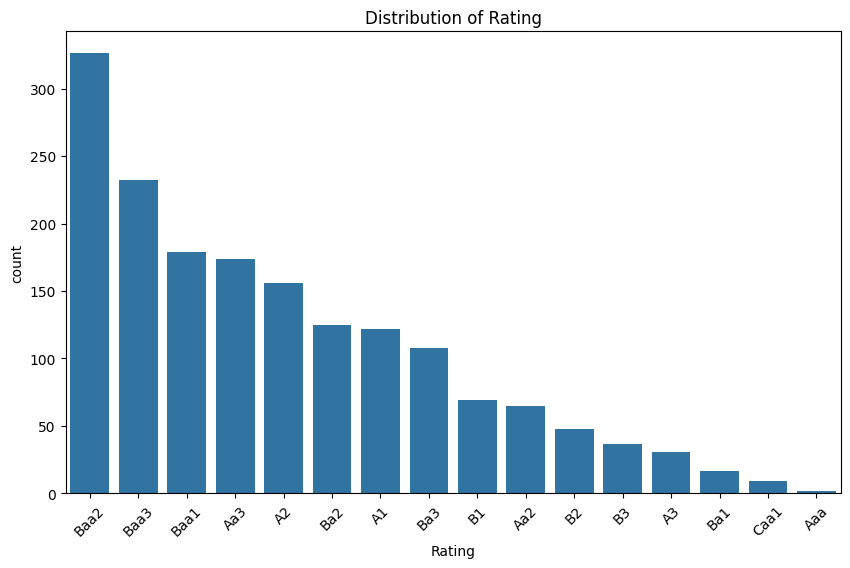
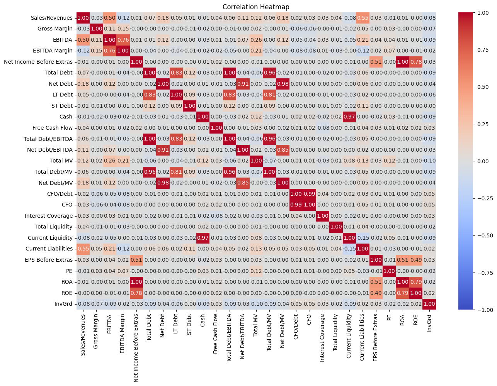
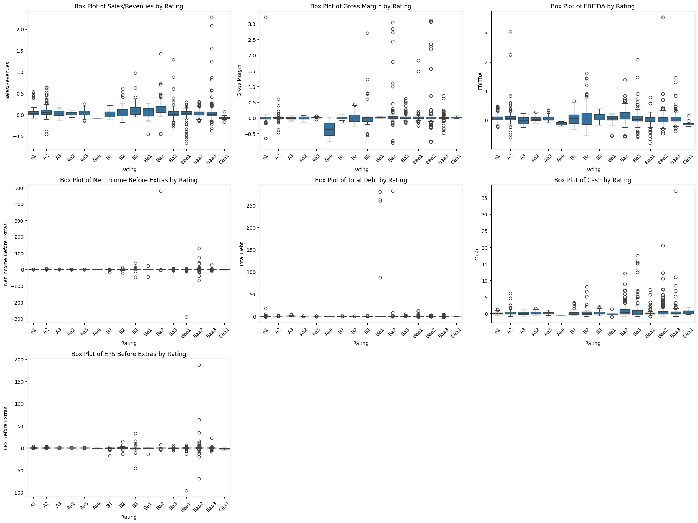
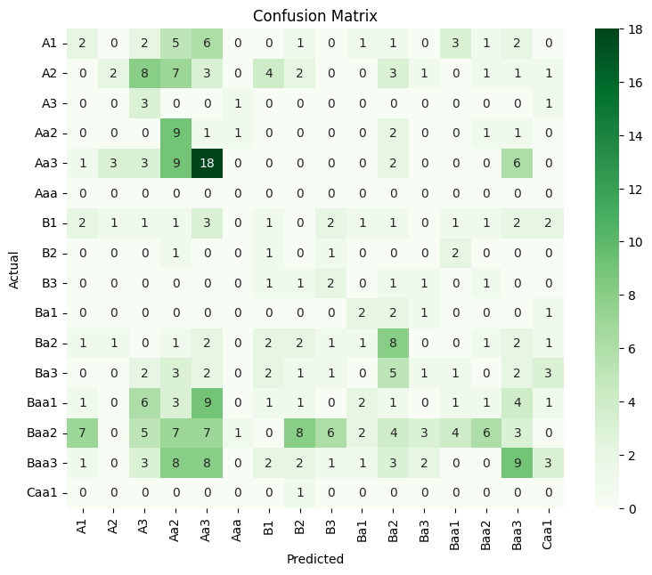
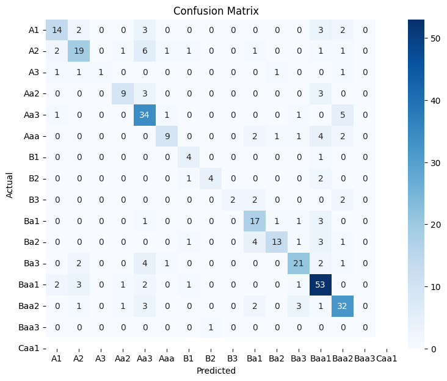

# Credit Score Classification Model

## Purpose
The purpose of this project is to develop a classification model to predict the credit rating of companies based on their financial metrics. This project involves data preprocessing, exploratory data analysis (EDA), model training, and evaluation.

Check out the code here: [Code file](classification_model.ipynb)

## Approach
1. **Data Loading and Preprocessing**:
   - Load the dataset and perform necessary preprocessing steps such as handling missing values, encoding categorical variables, and scaling numerical features.
   
2. **Exploratory Data Analysis (EDA)**:
   - Perform EDA to understand the data distribution, relationships between variables, and to identify any potential data quality issues.
   
3. **Model Implementation**:
   - Implement classification models using algorithms like Logistic Regression and Random Forest.
   - Use cross-validation and hyperparameter tuning to optimize the models.
   
4. **Model Evaluation**:
   - Evaluate the models using appropriate metrics like accuracy, precision, recall, F1-score, and confusion matrix.

## EDA Analysis of Plots

### 1. Distribution of the Target Variable (Rating)

The distribution plot shows that the dataset is imbalanced, with certain ratings having significantly more instances than others.

### 2. Correlation Heatmap

The heatmap reveals the relationships between different financial metrics. Highly correlated features can be identified, which may indicate redundancy.

### 3. Box plot for financial metrics i.e. feature variables

These plots illustrate the distribution, skewness, and presence of outliers for key financial metrics across different ratings. For example, higher ratings might show higher median values for certain metrics like EBITDA.

## Model Implementation Results

The logistic regression and random forest models were both implemented and evaluated. The hyperparameter tuning process helped to improve model performance. The final evaluation was done using classification reports and confusion matrices to compare the models' performance.

### Logistic Regression

#### Classification Report

| Class | Precision | Recall | F1-Score | Support |
|-------|-----------|--------|----------|---------|
| A1    | 0.13      | 0.08   | 0.10     | 24      |
| A2    | 0.29      | 0.06   | 0.10     | 33      |
| A3    | 0.09      | 0.60   | 0.16     | 5       |
| Aa2   | 0.17      | 0.60   | 0.26     | 15      |
| Aa3   | 0.31      | 0.43   | 0.36     | 42      |
| Aaa   | 0.00      | 0.00   | 0.00     | 0       |
| B1    | 0.07      | 0.05   | 0.06     | 19      |
| B2    | 0.00      | 0.00   | 0.00     | 5       |
| B3    | 0.14      | 0.29   | 0.19     | 7       |
| Ba1   | 0.20      | 0.33   | 0.25     | 6       |
| Ba2   | 0.24      | 0.35   | 0.29     | 23      |
| Ba3   | 0.11      | 0.04   | 0.06     | 23      |
| Baa1  | 0.08      | 0.03   | 0.05     | 31      |
| Baa2  | 0.46      | 0.10   | 0.16     | 63      |
| Baa3  | 0.28      | 0.21   | 0.24     | 43      |
| Caa1  | 0.00      | 0.00   | 0.00     | 1       |
| **Accuracy**       |           |        | 0.19     | 340     |
| **Macro Avg**      | 0.16      | 0.20   | 0.14     | 340     |
| **Weighted Avg**   | 0.25      | 0.19   | 0.17     | 340     |

#### Confusion Matrix

### Random Forest Classifier

#### Classification report

| Class | Precision | Recall | F1-Score | Support |
|-------|-----------|--------|----------|---------|
| A1    | 0.70      | 0.58   | 0.64     | 24      |
| A2    | 0.68      | 0.58   | 0.62     | 33      |
| A3    | 1.00      | 0.20   | 0.33     | 5       |
| Aa2   | 0.75      | 0.60   | 0.67     | 15      |
| Aa3   | 0.61      | 0.81   | 0.69     | 42      |
| B1    | 0.75      | 0.47   | 0.58     | 19      |
| B2    | 0.50      | 0.80   | 0.62     | 5       |
| B3    | 0.80      | 0.57   | 0.67     | 7       |
| Ba1   | 1.00      | 0.33   | 0.50     | 6       |
| Ba2   | 0.61      | 0.74   | 0.67     | 23      |
| Ba3   | 0.81      | 0.57   | 0.67     | 23      |
| Baa1  | 0.72      | 0.68   | 0.70     | 31      |
| Baa2  | 0.70      | 0.84   | 0.76     | 63      |
| Baa3  | 0.68      | 0.74   | 0.71     | 43      |
| Caa1  | 0.00      | 0.00   | 0.00     | 1       |
| **Accuracy**       |           |        | 0.68     | 340     |
| **Macro Avg**      | 0.69      | 0.57   | 0.59     | 340     |
| **Weighted Avg**   | 0.70      | 0.68   | 0.67     | 340     |

#### Confusion Matrix

## Conclusion

By comparing the confusion matrices and classification reports, we can determine that `Random Forest` performed better than `Logistic rgression` in classifying the firms.

- **Class Imbalance:** The dataset is imbalanced, which necessitates the use of techniques like RandomOverSampler to ensure the model is not biased towards the majority class.

- **Model Performance:** The classification report provides precision, recall, and F1-score for each class. Overall, the Random Forest Classifier outperforms the Logistic Regression model in terms of precision, recall, and F1-score across all classes. 
